# Jobsheet 3 - Angular Fundamental 

### Praktikum – Bagian 1: Component Basic
- Buatlah sebuah componen dengan nama **courses** dengan cara ketik perintah `ng generate component name` atau ` ng g c nama`

##### Soal 1
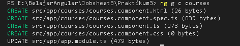

- Buka file **app.component.html**, lakukan modifikasi code menjadi seperti berikut:

```html
<app-courses></app-courses>

<router-outlet></router-outlet>
```

##### Soal 2
- Jalankan perintah `ng serve` untuk melihat hasil

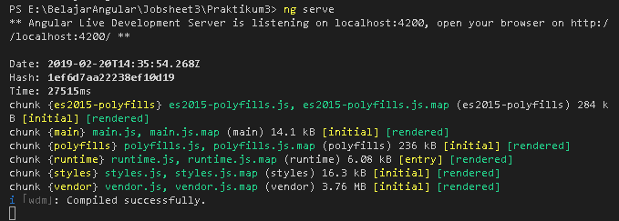

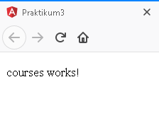

- Buka file **app.modules.ts** dan hapus course component pada declaration, seperti berikut:

```typescript
import { BrowserModule } from '@angular/platform-browser';
import { NgModule } from '@angular/core';

import { AppRoutingModule } from './app-routing.module';
import { AppComponent } from './app.component';
import { CoursesComponent } from './courses/courses.component';

@NgModule({
  declarations: [
    AppComponent,
//    CoursesComponent
  ],
  imports: [
    BrowserModule,
    AppRoutingModule
  ],
  providers: [],
  bootstrap: [AppComponent]
})
export class AppModule { }
```

##### Soal 3 
- Perhatikan hasilnya:

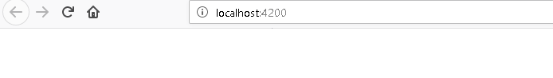

- Lakukan *inspect* pada halaman. Terdapat error setelag **Go to Definition** , **app-course** merupakan elemen yang tidak diketahui:

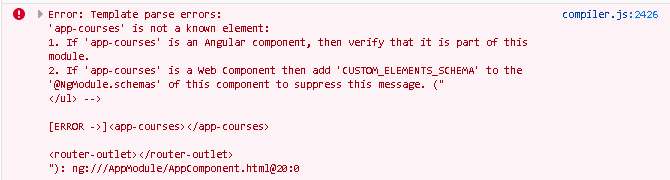


### Praktikum – Bagian 2: Templates

- Buka file **courses.component.ts** tambahkan property baru dengan nama *title*

```Typescript
import { Component, OnInit } from '@angular/core';
import { CoursesService } from '../courses.service';

@Component({
  selector: 'app-courses',
  templateUrl: './courses.component.html',
  styleUrls: ['./courses.component.css']
})
export class CoursesComponent implements OnInit {

  title = 'Belajar Angular';

    constructor() { }

  ngOnInit() {
  }
}
```
##### Soal 5 
- kemudian refresh browser

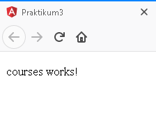

- Tambahkan string pada binding data. Buka file **courses.component.html**.

##### Soal 6 
- kemudian refresh browser


- Buka file **courses.component.ts** dan buatlah sebuah method dengan nama *getTitle* seperti berikut ini :

```typescript
import { Component, OnInit } from '@angular/core';
import { CoursesService } from '../courses.service';

@Component({
  selector: 'app-courses',
  templateUrl: './courses.component.html',
  styleUrls: ['./courses.component.css']
})
export class CoursesComponent implements OnInit {

  title = 'Belajar Angular';
  getTitle(){
    return this.title;
  }
  
  constructor() { }

  ngOnInit() {
  }
}
```
- Buka file **courses.component.html**, lakukan modifikasi seperti berikut:

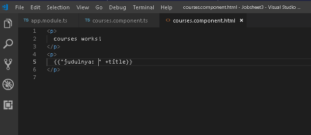

##### Soal 7 
- refresh dan perhatikan hasilnya

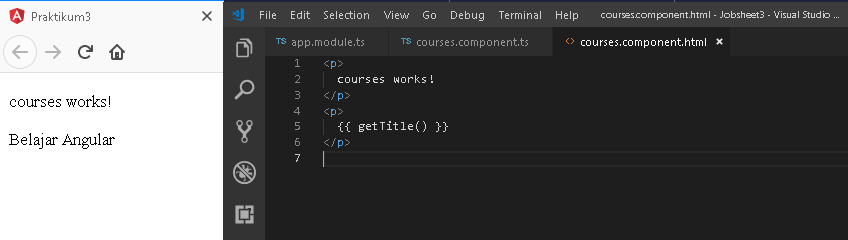

### Praktikum - Bagian 3: Directive

- Buka file **courses.component.ts** dan buat properti dengan nama *course* dengan data berupa array

```typescript
import { Component, OnInit } from '@angular/core';
import { CoursesService } from '../courses.service';

@Component({
  selector: 'app-courses',
  templateUrl: './courses.component.html',
  styleUrls: ['./courses.component.css']
})
export class CoursesComponent implements OnInit {

  title = 'Belajar Angular';
  Courses = [
    {id: 0, name:'HTML'},
    {id: 1, name:'PHP'},
    {id: 2, name:'ANGULAR'},
    {id: 3, name:'C#'},
    {id: 4, name:'VB.NET'},
  ]
  getTitle(){
    return this.title;
  }
  
  constructor() { }

  ngOnInit() {
  }
}
```
- Buka file **courses.component.html** tambahkan directive ngFor dan string interpolation seperti berikut:


##### Soal 8 
- refresh dan perhatikan hasilnya:

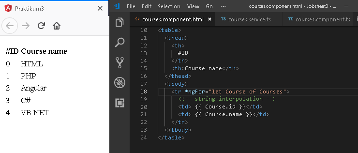

### Praktikum – Bagian 4: Services dan Dependency Injection
- Buatlah service baru yang bernama *courses* dengan perintah : `ng generate service` courses atau `ng g s courses`

##### Soal 9 
- hasilnya seperti berikut:

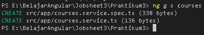

- Buka file **courses.service.ts** kemudian tambahkan method *getCourse* seperti berikut:

```typescript
import { Injectable } from '@angular/core';

@Injectable({
  providedIn: 'root'
})
export class CoursesService {

  constructor() { }

  getCourses() {
    return [
    {id: 0, name:'HTML'},
    {id: 1, name:'PHP'},
    {id: 2, name:'ANGULAR'},
    {id: 3, name:'C#'},
    {id: 4, name:'VB.NET'},
    ];
  }
}
```
- Buka file **courses.component.ts**, kemudikan lakukan modifikasi codenya seperti berikut:

```typescript
import { Component, OnInit } from '@angular/core';
import { CoursesService } from '../courses.service';

@Component({
  selector: 'app-courses',
  templateUrl: './courses.component.html',
  styleUrls: ['./courses.component.css']
})
export class CoursesComponent implements OnInit {

  title = 'Belajar Angular';
  Courses;
  
  constructor() { }

  ngOnInit() {
  }
}
```
##### Soal 10 
- hasilnya seperti berikut:

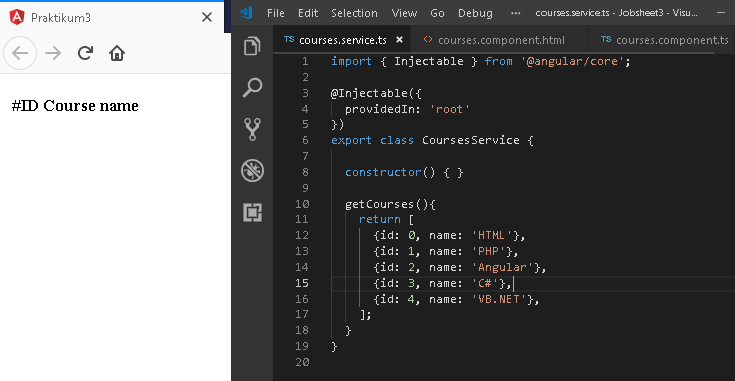

* Tambahkan constructor pada file **courses.component.ts** seperti berikut:

```typescript
import { Component, OnInit } from '@angular/core';
import { CoursesService } from '../courses.service';

@Component({
  selector: 'app-courses',
  templateUrl: './courses.component.html',
  styleUrls: ['./courses.component.css']
})
export class CoursesComponent implements OnInit {

  title = 'Belajar Angular';
  Courses;

  constructor(private service:CoursesService) {
    this.Courses=service.getCourses();
  }

  ngOnInit() {
  }
}
```
##### Soal 11 
- hasilnya seperti berikut:

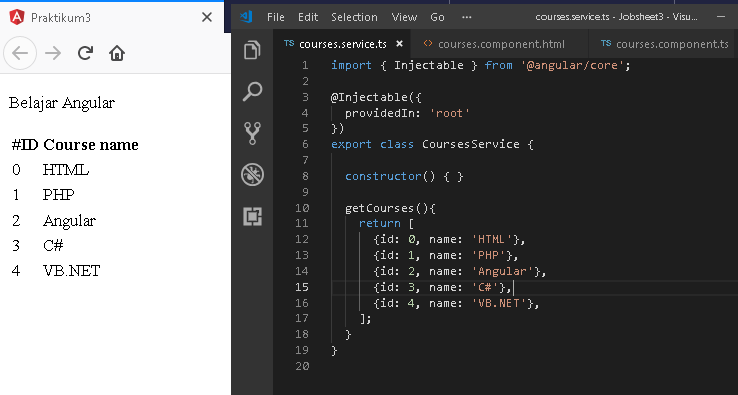