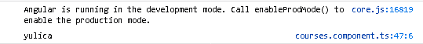

# Jobsheet 4 - Displaying Data And Binding Data

### Praktikum – Bagian 1: Component Basic
* Buka file **courses.component.ts** kemudian tambahkan code seperti berikut:

```typescript
import { Component, OnInit } from '@angular/core';
import { CoursesService } from '../courses.service';

@Component({
  selector: 'app-courses',
  templateUrl: './courses.component.html',
  styleUrls: ['./courses.component.css']
})
export class CoursesComponent implements OnInit {

  Title = 'Belajar Angular';
  Courses;

  binding = 'property-binding';
  imageUrl = 'http://lorempixel.com/400/200';

  constructor(private service:CoursesService) { 
    this.Courses = service.getCourses;
  }

  ngOnInit() {
  }

}
```

* Buka file **courses.component.html** lalu tambahkan code seperti berikut:

```html
<p>
  {{ Title }}
</p>
<table>
  <thead>
    <th>
      #ID
    </th>
    <th>Course name</th>
  </thead>
  <tbody>
    <tr *ngFor = "let Course of Courses">
    <td>{{ Course.id }}</td>
    <td>{{ Course.name }}</td>
    </tr>
  </tbody>
</table>

<h2>{{ binding }}</h2>
<h2 [textContent]='binding'></h2>


```

##### Soal 1
* Hasilnya seperti berikut


### Praktikum – Bagian 2: Attribute Binding###
* Buka file **courses.component.ts** tambahkan properti colspan dibawah line imageUrl

```typescript
  binding = 'property-binding';
  imageUrl = 'http://lorempixel.com/400/200';
  colSpan = 2;
```
* Buka file courses.component.html dan tambahkan berikut ini :

```html
<table>
  <tr>
    <td [colspan]='colSpan'></td>
  </tr>
</table>
```

* Maka akan muncul error


* Tambahkan attr pada colspan seperti berikut:

```html
<table>
  <tr>
    <td [attr.colspan]='colSpan'></td>
  </tr>
</table>
```
* Selanjutnya tambahkan button pada file **courses.component.html** seperti berikut :

```html
<table>
  <tr>
    <td [attr.colspan]='colSpan'></td>
  </tr>
  <button type='button' class="btn btn-primary">tambah</button>
</table>
```

##### Soal 2
* Maka akan tampil seperti gambar dibawah


### Praktikum - Bagian 3: Class Binding###
* Buka file **courses.component.ts** dan tambahkan properti isActive = true setelah line colspan = 2;

```typescript
  binding = 'property-binding';
  imageUrl = 'http://lorempixel.com/400/200';
  colSpan = 2;
  isActive = true;
```
* Buka file **courses.component.html** lalu tambahkan class binding seperti berikut :

```html
<table>
  <tr>
    <td [attr.colspan]='colSpan'></td>
  </tr>
  <button type='button' class="btn btn-primary">tambah</button>
</table>
```

##### Soal 3
* maka akan menghasilkan


### Praktikum – Bagian 4: Style Binding###

* Buka file **courses.component.html** lalu tambahkan class binding seperti berikut :

```html
<table>
  <tr>
    <td [attr.colspan]='colSpan'></td>
  </tr>
  <button type='button' class="btn btn-primary">tambah</button>
</table>

<button type="button" class="btn btn-primary" [class.active]="isActive">Tambah</button>

<button type="button" class="btn btn-primary" [style.backgroundColor]="isActive?'blue':'white'">Style</button>
<br>
```

##### Soal 4
* Hasil setelah di execute


### Praktikum - Bagian 5: Event Binding###
* Buka file **course.component.ts** dan buatlah method dengan nama onSave()

```typescript
onSave() {
    console.log("button sudah diklik")
  }
```
* Buka file **courses.component.html** dan tambahkan event click

```typescript
<button type="button" class="btn btn-default" (click)="onSave()">Button</button>
```

##### Soal 5
* Hasil jika di klik maka pada console akan muncul keterangan


* Buka file courses.component.ts tambahkan parameter $event

```typescript
  onSave($event) {
    console.log("button sudah diklik",$event)
  }
```

* Tambahkan juga pada courses.component.html

```html
<button type="button" class="btn btn-danger" (click)="onSave($event)">Button</button>
```

* Maka hasilnya akan menampilkan pointerEvent


* Buatlah method onDivClick() pada file **courses.component.ts**

```typescript
  onDivClick($event) {
    console.log("ini method div",$event)
  }
```

* Tambahkan div dan event binding pada div elemen pada file **courses.component.html**

```html
<div (click)="onDivClick($event)">
  <button type="button" class="btn btn-danger"
  (click)="onSave($event)">Button</button>
</div>
```

##### Soal 6
* Hasil yang didapat seperti berikut:


* jika button sudah diklik juga akan muncul karena tidak ada pemberhentian button


* Untuk mengatasi event bubbling maka tambahkan $event.stopPropagation pada file **courses.component.ts**

```typescript
  onSave($event) {
    $event.stopPropagation();
    console.log("button sudah diklik",$event)
  }
```

##### Soal 7
* Hasil yang didapat seperti berikut:


### Praktikum – Bagian 6: Event Filtering###
* Buat inputan pada file **courses.component.html**

```html
<input type="text" (keyup.enter)="onKeyUp()">
```

* Tambahkan method onKeyUp pada file **courses.component.ts**

```typescript
  onKeyUp() {
    console.log("enter was pressed");
  }
```

##### Soal 8
* Hasil setelah di enter saat diberi inputan *yulica*


##### Soal 9
* Hasil saat diberi inputan button 'enter'


### Praktikum – Bagian 7: Template Variable###
* Tambahkan variabel #nama pada file **courses.component.html**

```html
<input type="text" #nama (keyup.enter)="onKeyUp(nama.value)">
```

* Tambahkan parameter nama pada method onKeyUp pada file **courses.component.ts**

```typescript
  onKeyUp(nama) {
      console.log(nama);
    }
```

##### Soal 10
* Hasil yang didapat ketika adanya parameter maka hasil akan sesuai dengan apa yang diinputkan




### Praktikum - Bagian 8: Two Way Binding###
* Buat property baru dengan nama kalian masing-masing dan rubah parameter pada log pada file **courses.component.ts**

```typescript
  binding = 'property-binding';
  imageUrl = 'http://lorempixel.com/400/200';
  colSpan = 2;
  isActive = false;
  nama = 'yuli';
```

* Tambahkan parameter nama pada method onKeyUp

```html
<input type="text" [value]="nama" (keyup.enter)="nama = $event.target.value;onKeyUp()">
```

##### Soal 11
* Hasil


* Buka file **app.module.ts** dan tambahkan formmodule seperti berikut :

```typescript
  imports: [
    BrowserModule,
    AppRoutingModule,
    FormsModule
  ],
```

* Buka file **course.component.html**, modifikasi code nya seperti berikut :


```html
<input type="text" [(ngModel)] = "nama" (keyup.enter)="onKeyUp()">
```

##### Soal 12
* Hasilnya adalah


